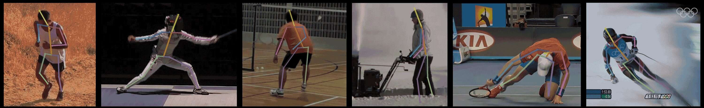

<p align="center">
  
</p>
<h3 align="center">🎬 影片分割工具</h3>

---

使用 node.js 搭配 FFmpeg

### 可使用模型

1. PoseNet

   - posenet

2. Efficient Pose

   - efficientpose-i-lite
   - efficientpose-ii-lite
   - efficientpose-iv

3. Blaze Pose

   - 開發中

---

## 設定運行環境

### 1. 安裝專案

```bash
git clone git@github.com:PSheon/video-to-frames.git
```

### 2. 調整設定，位置在 `config` 下

測試用： `development.js`、專案用：`production.js`

```bash
cp config/default.js config/production.js
```

### 3. 將設定的影片放到相對應的位置，預設是 `input` 資料夾下放置 `input.mp4`

**_如果沒有影片 input 資料夾下有 sample.mp4_**

### 4. 使用工具

<details>
  <summary>Options 1. 使用 Docker 建立本地容器</summary>

建立本地容器

```bash
docker build -t video-to-frames .
```

執行容器

```bash
npm run start
```

</details>
<details>
  <summary>Options 2. 使用 Node.js</summary>

執行專案

```bash
npm install && npm run start
```

</details>

文件製作中...
