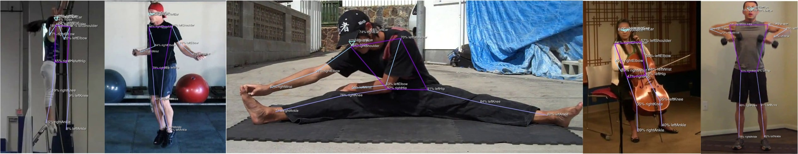

<p align="center">
  
  
</p>
<h3 align="center">🎬 影片分割 + 🏃圖片肢體偵測 工具</h3>

<p align="center">
  <a href="https://github.com/PSheon/video-to-frames/actions/workflows/node.yml">
    
  </a>
  <a href="https://github.com/PSheon/video-to-frames/actions/workflows/doxker.yml">
    
  </a>
</p>

---

使用 node.js 搭配 FFmpeg

### 可使用模型

1. PoseNet

   - posenet

2. Efficient Pose

   - efficientpose-i-lite
   - efficientpose-ii-lite
   - efficientpose-iv

3. Efficient Pose

   - movenet-lightning
   - movenet-thunder

4. Blaze Pose

   - 開發中

---

## 設定運行環境

### 1. 安裝專案

```bash
git clone git@github.com:PSheon/video-to-frames.git
```

### 2. 調整設定，位置在 `config` 下

測試用： `development.js`

專案用：`production.js`

```bash
cp config/default.js config/production.js
```

### 3. 將設定的影片放到相對應的位置

**_預設使用 `input` 資料夾下的 `sample.mp4`_**

### 4. 使用工具

<details>
  <summary>Options 1. 使用 Node.js 本地開發</summary>

安裝 Node.js 相依套件

```bash
npm install
```

開始開發

```bash
npm run dev
```

</details>
<details>
  <summary>Options 2. 使用 Docker 建立本地容器</summary>

建立本地容器與第一次建立容器

```bash
npm run docker:build && npm run docker:init
```

容器被建立後可直接執行

```bash
npm run docker:run
```

</details>
<details>
  <summary>Options 3. 使用 Node.js 建立專案版本</summary>

安裝相依套件並編譯 TS

```bash
npm install && npm run build
```

```bash
npm run start
```

</details>

---

## 可設定內容說明

建立文件中...
